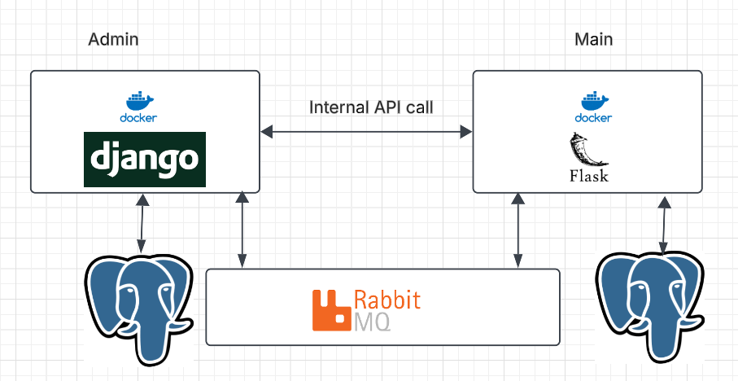

# Python Microservices Architecture

A simple microservices architecture built with **Django REST Framework**, **Flask**, **PostgreSQL**, **RabbitMQ**, and **Docker**. The project demonstrates how independent services communicate using both synchronous REST APIs and asynchronous messaging.

---

## Architecture



---

## Overview

This project consists of two independent microservices:

### Admin Service (Django)

Responsible for managing products.

Responsibilities:

- Create, update and delete products
- Expose REST APIs
- Store product information
- Consume RabbitMQ events
- Update product likes when notified by another service

### Main Service (Flask)

Responsible for user interactions.

Responsibilities:

- Retrieve products
- Handle product likes
- Publish events to RabbitMQ
- Notify the Admin Service about user actions

Each service has its own database and can be developed and deployed independently.

---

## Tech Stack

### Admin Service

- Django
- Django REST Framework
- PostgreSQL
- RabbitMQ (Pika)
- Docker

### Main Service

- Flask
- Flask SQLAlchemy
- PostgreSQL
- RabbitMQ (Pika)
- Docker

---

## Project Structure

```text
python-microservices/
├── admin/
│   ├── admin/
│   ├── products/
│   ├── manage.py
│   ├── Dockerfile
│   ├── docker-compose.yml
│   └── requirements.txt
│
├── main/
│   ├── main.py
│   ├── producer.py
│   ├── consumer.py
│   ├── Dockerfile
│   ├── docker-compose.yml
│   └── requirements.txt
│
├── docs/
│   └── architecture.png
│
└── README.md
```

---

## Service Communication

### Synchronous Communication

The Main Service requests product information through REST APIs exposed by the Admin Service.

```text
Main Service
      │
      ▼
Admin Service
      │
      ▼
PostgreSQL
```

### Asynchronous Communication

When a user likes a product:

1. Main Service publishes a RabbitMQ event.
2. Admin Service consumes the event.
3. Product like count is updated.

```text
User Likes Product
        │
        ▼
Main Service
        │
Publish Event
        │
        ▼
RabbitMQ
        │
Consume Event
        │
        ▼
Admin Service
        │
Update Likes
        │
        ▼
PostgreSQL
```

---

## API Endpoints

### Admin Service

| Method | Endpoint              | Description    |
| ------ | --------------------- | -------------- |
| GET    | `/api/products/`      | List products  |
| POST   | `/api/products/`      | Create product |
| PUT    | `/api/products/{id}/` | Update product |
| DELETE | `/api/products/{id}/` | Delete product |

### Main Service

| Method | Endpoint                  | Description       |
| ------ | ------------------------- | ----------------- |
| GET    | `/api/products`           | Retrieve products |
| POST   | `/api/products/<id>/like` | Like a product    |

---

## Environment Variables

Create a `.env` file using `.env.example`.

Example:

```env
DB_NAME=your_database_name
DB_USER=your_database_user
DB_PASSWORD=your_database_password
DB_HOST=db
DB_PORT=5432

CLOUDAMQP_URL=your_cloudamqp_connection_url
```

---

## Running the Project

### Clone the repository

```bash
git clone <repository-url>
cd python-microservices
```

### Start the Admin Service

```bash
cd admin
docker compose up --build
```

Runs on:

```
http://localhost:8000
```

---

### Start the Main Service

Open another terminal.

```bash
cd main
docker compose up --build
```

Runs on:

```
http://localhost:8001
```

---

## Database

Each microservice owns its own PostgreSQL database.

This follows the Database per Service pattern commonly used in microservice architectures.

---

## Message Broker

RabbitMQ is used for asynchronous communication between services.

Benefits:

- Loose coupling
- Better scalability
- Event-driven communication
- Independent service deployment

---

## Features

- Microservices architecture
- Independent PostgreSQL databases
- REST APIs
- Event-driven communication
- RabbitMQ integration
- Dockerized services
- Environment-based configuration
- Separation of concerns

---

## Future Improvements

- API Gateway
- Authentication Service
- JWT-based authorization
- Service discovery
- Distributed logging
- Monitoring with Prometheus and Grafana
- Kubernetes deployment
- CI/CD pipeline
- Automated testing
- Retry and dead-letter queues for RabbitMQ

---

## License

This project is intended for learning and demonstration purposes.
